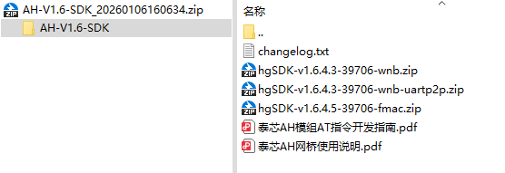

## T-Halow SDK Description

The AH-V1.6-SDK package contains three AH module projects.
Each project can be compiled independently.

The AH-V1.6-SDK development environment requires the installation of the CDK environment.
For environment setup, please refer to 《泰芯TXW830x AH-SDK开发指南.pdf》.

The file descriptions are as follows:

| File                             | Description                                       |
| :------------------------------- | :------------------------------------------------ |
| hgSDK-v1.6.4.3-39706-wnb         | -wnb corresponds to the Ethernet interface        |
| hgSDK-v1.6.4.3-39706-wnb-uartp2p | -uartp2p serial port transparent transmission     |
| hgSDK-v1.6.4.5-39706-fmac        | -fmac corresponds to SDIO / UART / USB interfaces |
| 泰芯AH模组AT指令开发指南                   | AT command description                            |
| 泰芯AH网桥使用说明                       | Bridge configuration instructions                 |

`-wnb` is an Ethernet interface project. The main communication method is Ethernet communication, supporting TCP/UDP protocols with a communication speed of 90 Mbit/s.
The default serial port baud rate is 115200, which is used for sending and receiving AT commands and outputting debug information. It also supports a small amount of data transmission via the serial port.

`-uartp2p` is a serial port transparent transmission project. After successful pairing, data can be transmitted directly through the serial port. The transmission rate is affected by the serial port baud rate.
The default serial port baud rate is 115200. The baud rate can be modified by changing the `UART_P2P_BAUDRATE` definition.

Note that:

1. The packet length must be limited to 1500 bytes.

2. The baud rate should not be too high; otherwise, there is a risk of data loss. Generally, 400 kbps is recommended as an upper limit. At 921600, there is a relatively high risk of data loss.

`-fmac` is a communication project based on SDIO/SPI, UART, and USB interfaces. The primary communication methods are SDIO/SPI, UART, and USB. Taking SPI communication as an example, the data rate is approximately 25 Mbit/s.
The default serial port baud rate is 115200, which is used for sending and receiving AT commands and for outputting debug information. It also supports a small amount of data transmission via the serial port.
