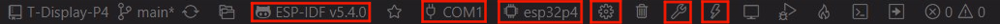

<h1 align = "center">T-Halow-P4 debug</h1>

### ESP-IDF Visual Studio Code
1. 安装 [Visual Studio Code](https://code.visualstudio.com/Download) ，根据你的系统类型选择安装。

2. 打开 VisualStudioCode 软件侧边栏的“扩展”（或者使用<kbd>Ctrl</kbd>+<kbd>Shift</kbd>+<kbd>X</kbd>打开扩展），搜索“ESP-IDF”扩展并下载。

3. 在安装扩展的期间，使用git命令克隆仓库

        git clone -b debug --recursive https://github.com/Xinyuan-LilyGO/T-Halow-P4.git

    克隆时候需要同时加上“--recursive”，如果克隆时候未加上那么之后使用的时候需要初始化一下子模块

        git submodule update --init --recursive

4. 下载安装 [ESP-IDF v5.4.1](https://dl.espressif.cn/dl/esp-idf/?idf=4.4)，记录一下安装路径，打开之前安装好的“ESP-IDF”扩展打开“配置 ESP-IDF 扩展”，选择“USE EXISTING SETUP”菜单，选择“Search ESP-IDF in system”栏，正确配置之前记录的安装路径：
   - **ESP-IDF directory (IDF_PATH):** `你的安装路径xxx\Espressif\frameworks\esp-idf-v5.4`  
   - **ESP-IDF Tools directory (IDF_TOOLS_PATH):** `你的安装路径xxx\Espressif`  
    点击右下角的“install”进行框架安装。

5. 点击 Visual Studio Code 底部菜单栏的 ESP-IDF 扩展菜单“SDK 配置编辑器”，在搜索栏里搜索“Select the example to build”字段，选择你所需要编译的项目，再在搜索栏里搜索“Select the camera type”字段，选择你的板子板载的摄像头类型，点击保存。

6. 点击 Visual Studio Code 底部菜单栏的“设置乐鑫设备目标”，选择**ESP32P4**，点击底部菜单栏的“构建项目”，等待构建完成后点击底部菜单栏的“选择要使用的端口”，之后点击底部菜单栏的“烧录项目”进行烧录程序。

    

