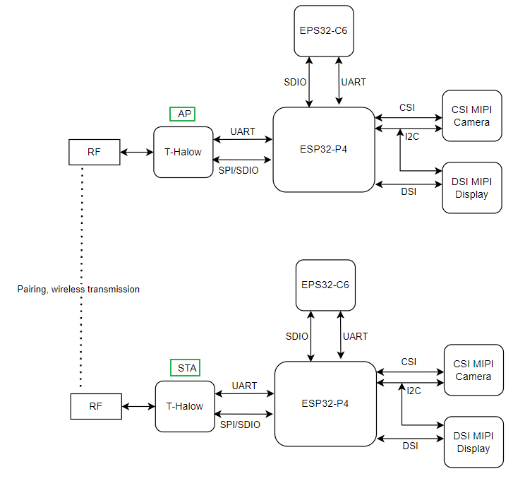

<h1 align = "center">🏆T-Halow-P4🏆</h1>

## :zero: Version 🎁

### 1、Version

### 2、Where to buy.

## :one: Product 🎁
1. ESP32P4 supports common peripherals such as SPI, I2S, I2C, LED PWM, MCPWM, RMT, ADC, UART and TWAI™. It also supports USB OTG 2.0 HS, Ethernet and SDIO Host 3.0; with 32 MB PSRAM in the package, QSPI interface connected to 16 MB Nor Flash;
2. The board is equipped with MIPI-DSI display interface, supporting JPEG image decoding (1080P 30fps), PPA (pixel processing accelerator), 2D DMA (2D image accelerator);
3. The board is equipped with MIPI-CSI camera interface, 1080P picture, ISP, H264 encoding, JPEG encoding;
4. An ESP32-C6-MINI is externally attached, using SDIO to expand WIFI6 or BLE5 wireless functions (using esp-hosted-mcu scheme);
5. With T-Halow module, supporting WIFI Halow, with the same transmission power provided for 2.4GHz and 5GHz, the transmission distance is farther;

## :two: Module 🎁

### 1、Halow Module

**1）Quick Start**

[examples/halow_spi_single](./examples/halow_spi_single/) demonstrates how the Halow module performs data transmission and reception. The data transmission path is as follows:

~~~
ESP32P4 -> SPI/SDIO -> Halow -> RF (AP) -> RF (STA) -> SPI/SDIO -> Halow -> ESP32P4
~~~

The Halow module is connected to the ESP32P4 via **SPI + UART**;

SPI is used for data transmission and uses the official Taixin driver  
[taixin-nonos-driver](https://www.taixin-semi.com/upload/files/productFile/20251204/taixin-nonos-driver_20251204162053.zip). The driver principles and API interfaces can be found in [泰芯non-os_WiFi驱动开发指南.pdf](./hardware/泰芯non-os_WiFi驱动开发指南.pdf);

UART is used to send and receive AT commands and to display runtime information.  
For AT command usage, refer to [AT_cmd.md](./doc/AT_cmd.md). For more details, see [泰芯AH模组AT指令开发指南.pdf](./hardware/泰芯AH模组AT指令开发指南.pdf)

**2）AH-V1.6-SDK**

Provides a project for generating Halow firmware.  
Refer to [AH-V1.6-SDK Description](./AH-V1.6-SDK/readme.md)

## :three: Quick Start 🎁

### 1、ESP-IDF Environment Setup

All example projects are compiled under the esp-idf v5.4.1 environment. Therefore, when using the T-Halow-P4 examples, please ensure that the esp-idf version is ≥ 5.4.1.

For setting up the esp-idf build environment, please refer to the official ESP32 documentation:

https://docs.espressif.com/projects/esp-idf/en/v5.5.2/esp32/get-started/index.html

### 2、Project Build

**1)  Project Configuration**

Please enter the `examples/xxx` directory, set ESP32P4 as the target chip, and then run the project configuration tool menuconfig.

The example projects under the examples directory have already been configured via the `sdkconfig.defaults` file, so you can directly use idf.py build to compile the project.

~~~bash
cd ~/examples/xxx
idf.py set-target esp32p4
idf.py menuconfig
~~~

**2) Build and Flash**

Please use the following commands to build and flash the project:

idf.py build

Before downloading the program, the ESP32P4 development board should be set to download mode as follows:

~~~text
1. Connect the USB cable and open a serial terminal;
2. Press and hold the BOOT button on the P4 board;
3. While holding BOOT, press the RST button, then release it immediately.
   When the serial output shows "wait for download", 
   the board has entered download mode;
4. Release the BOOT button and close the serial terminal;
~~~

After entering download mode, run the following command to flash the generated binary files to the ESP32P4 development board:

~~~bash
idf.py -p PORT flash
~~~

On Windows, PORT is usually `COMxx`.

on Linux, PORT is usually `/dev/ttyxx`.

After flashing is complete, reset the device to run the program.

## :four: Pins 🎁

~~~c

/******************************
 *          I2C Pin
 ******************************/

 I2C_SCL   ---   IO8
 I2C_SDA   ---   IO7

/******************************
 *          Halow Pin
 ******************************/

AH_CMD   ---   IO44
AH_CLK   ---   IO43
AH_D3    ---   IO42
AH_D2    ---   IO41
AH_D1    ---   IO40
AH_D0    ---   IO39
AH_TX    ---   IO12
AH_RX    ---   IO13

/******************************
 *         ESP32C6 Pin
 ******************************/

ESP32C6_CMD    ---   IO19
ESP32C6_CLK    ---   IO18
ESP32C6_D3     ---   IO17
ESP32C6_D2     ---   IO16
ESP32C6_D1     ---   IO15
ESP32C6_D0     ---   IO14
ESP32C6_WAKEUP ---   IO6

/******************************
 *         Camera/LCD Pin
 ******************************/

// By default, there is no Camera and LCD.
// The MIPI interface used by the Camera and LCD, 
// and the connection method with esp32P4 is as follows

TOUCH_SCL    ---   IO8
TOUCH_SDA    ---   IO7
TOUCH_INT    ---   IO11
TOUCH_RST    ---   IO10
MIPI_DSI_RST ---   IO9

                                   GND                                                                   GND
                ┌────────────────────────────────────────────────┐             ┌─────────────────────────────────────────────────────────┐
                │                                                │             │                                                         │
                │                                                │             │                                                         │
                │                                                │             │                                                         │
                │                                                │             │                                                         │
                │                                                │             │                                                         │
                │                                                │             │                                                         │
                │                                                │             │                                                         │
                │                                                │             │                                                         │
                │                                ┌───────────────┴─────────────┴──────────────────┐                                      │
                │                                │                                                │                           ┌──────────┴───────────┐
                │                                │                                                │      DSI DATA 1P          │                      │
                │                                │                                                ├───────────────────────────┤                      │
    ┌───────────┴─────────┐ CSI DATA 1P          │                                                │                           │                      │
    │                     ├──────────────────────┤                                                │      DSI DATA 1N          │                      │
    │                     │                      │                                                ├───────────────────────────┤                      │
    │                     │ CSI DATA 1N          │                  ESP32-P4                      │                           │                      │
    │       Camera        ├──────────────────────┤                                                │      DSI CLK N            │      LCD Screen      │
    │                     │                      │                                                ├───────────────────────────┤                      │
    │                     │ CSI CLK N            │                                                │                           │                      │
    │                     ├──────────────────────┤                                                │      DSI CLK P            │                      │
    │                     │                      │                                                ├───────────────────────────┤                      │
    │                     │ CSI CLK P            │                                                │                           │                      │
    │                     ├──────────────────────┤                                                │      DSI DATA 0P          │                      │
    │                     │                      │                                                ├───────────────────────────┤                      │
    │                     │ CSI DATA 0P          │                                                │                           │                      │
    │                     ├──────────────────────┤                                                │      DSI DATA 0N          │                      │
    │                     │                      │                                                ├───────────────────────────┤                      │
    │                     │ CSI DATA 0N          │                                                │                           │                      │
    │                     ├──────────────────────┤                                                │                           └──────────────────────┘
    │                     │                      │                                                │
    └───────┬──┬──────────┘                      │                                                │
            │  │           I2C SCL               │                                                │
            │  └─────────────────────────────────┤                                                │
            │              I2C SDA               │                                                │
            └────────────────────────────────────┤                                                │
                                                 └────────────────────────────────────────────────┘

~~~

## :five: Test 🎁

## :six: FAQ 🎁

## :seven: Schematic & 3D 🎁
