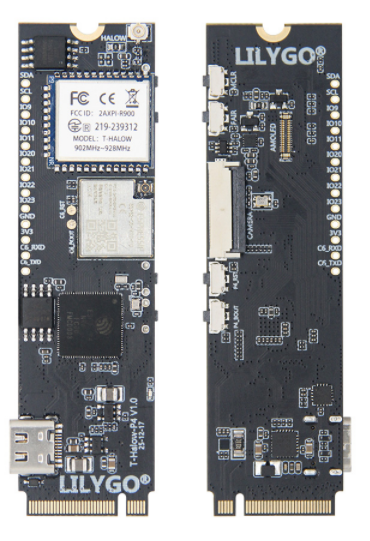

<h1 align = "center">🏆T-Halow-P4🏆</h1>

## :zero: Version 🎁

### 1、Version

### 2、Where to buy.

## :one: Product 🎁

## :two: Module 🎁

## :three: Quick Start 🎁

## :four: Pins 🎁

                                   GND                                                                   GND
                ┌────────────────────────────────────────────────┐             ┌─────────────────────────────────────────────────────────┐
                │                                                │             │                                                         │
                │                                                │             │                                                         │
                │                                                │             │                                                         │
                │                                                │             │                                                         │
                │                                                │             │                                                         │
                │                                                │             │                                                         │
                │                                                │             │                                                         │
                │                                                │             │                                                         │
                │                                ┌───────────────┴─────────────┴──────────────────┐                                      │
                │                                │                                                │                           ┌──────────┴───────────┐
                │                                │                                                │      DSI DATA 1P          │                      │
                │                                │                                                ├───────────────────────────┤                      │
    ┌───────────┴─────────┐ CSI DATA 1P          │                                                │                           │                      │
    │                     ├──────────────────────┤                                                │      DSI DATA 1N          │                      │
    │                     │                      │                                                ├───────────────────────────┤                      │
    │                     │ CSI DATA 1N          │                  ESP32-P4                      │                           │                      │
    │       Camera        ├──────────────────────┤                                                │      DSI CLK N            │      LCD Screen      │
    │                     │                      │                                                ├───────────────────────────┤                      │
    │                     │ CSI CLK N            │                                                │                           │                      │
    │                     ├──────────────────────┤                                                │      DSI CLK P            │                      │
    │                     │                      │                                                ├───────────────────────────┤                      │
    │                     │ CSI CLK P            │                                                │                           │                      │
    │                     ├──────────────────────┤                                                │      DSI DATA 0P          │                      │
    │                     │                      │                                                ├───────────────────────────┤                      │
    │                     │ CSI DATA 0P          │                                                │                           │                      │
    │                     ├──────────────────────┤                                                │      DSI DATA 0N          │                      │
    │                     │                      │                                                ├───────────────────────────┤                      │
    │                     │ CSI DATA 0N          │                                                │                           │                      │
    │                     ├──────────────────────┤                                                │                           └──────────────────────┘
    │                     │                      │                                                │
    └───────┬──┬──────────┘                      │                                                │
            │  │           I2C SCL               │                                                │
            │  └─────────────────────────────────┤                                                │
            │              I2C SDA               │                                                │
            └────────────────────────────────────┤                                                │
                                                 └────────────────────────────────────────────────┘

## :five: Test 🎁

## :six: FAQ 🎁

## :seven: Schematic & 3D 🎁

NULL

# This warehouse is temporarily unavailable

## ESP32P4-Halow 核心板

### 功能特性：

1. ESP32P4 支持 SPI、I2S、I2C、LED PWM、MCPWM、RMT、ADC、UART 和 TWAI™ 等常用外设。它还支持 USB OTG 2.0 HS、以太网和 SDIO Host 3.0；封装内叠封32 MB PSRAM，QSPI接口连接16MB Nor Flash；
2. 板载 MIPI-DSI 显示屏接口，支持 JPEG 图像解码(1080P 30fps)，PPA(像素处理加速器)，2D DMA(2D图像加速器)；
3. 板载 MIPI-CSI 摄像他接口，1080P画面，ISP，H264编码，JPEG编码；
4. 外挂 ESP32-C6-MINI，使用 SDIO 扩展 WIFI6 或 BLE5 无线功能 (使用 esp-hosted-mcu 方案)；
5. 带有 T-Halow 模块，支持 WIFI Halow，在提供2.4GHz和5GHz相同传输功率的情况下，传输距离更远；

### 编译环境

esp-idf v5.4 

### 使用的idf的库

- [ESP Registry](https://components.espressif.com/)
- [ESP Registry Document](https://docs.espressif.com/projects/idf-component-manager/en/latest/index.html)

~~~bash

"espressif/esp_hosted^1.4.1"

"espressif/esp_wifi_remote^0.8.5"

"espressif/esp_lcd_ek79007^1.0.2"

"lvgl/lvgl"

~~~